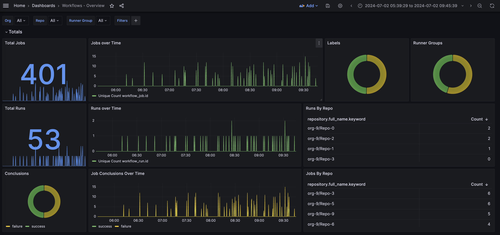
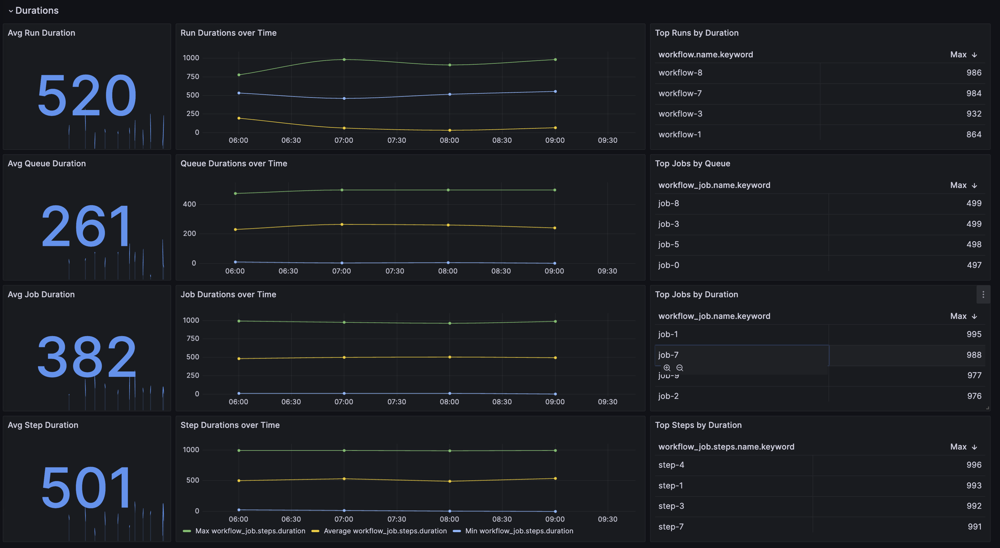

# github-actions-metrics

Repository with Example references for GitHub Actions Metrics visualizations

> [!NOTE]
> The content in this repository is for demonstration purposes only and should not be used in a production environment directly.

## Grafana & OpenSearch

[./grafana-opensearch](./grafana-opensearch)

This directory contains the necessary configuration and code to set up a Grafana dashboard with OpenSearch as the datasource. It's designed to collect and visualize data from webhooks using OpenSearch and Grafana.

### Contents

- **`.env` and `.env.example`**: Environment variable files. Copy `.env.example` to `.env` and update the values according to your OpenSearch setup.
- **`docker-compose.yml`**: Docker Compose file to spin up the OpenSearch cluster, Grafana, and the webhook collector service.
- **`data/grafana/provisioning`**: Contains Grafana provisioning files for datasources and dashboards, allowing Grafana to automatically load the OpenSearch datasource and predefined dashboards on startup.
  - **`dashboards/default.yaml`**: Configuration for dashboard provisioning.
  - **`datasources/default.yaml`**: Configuration for datasource provisioning, including the OpenSearch datasource.
- **`webhook-collector`**: A simple Node.js application that collects GitHub webhooks and stores them in OpenSearch.
  - **`index.js`**: The main application file.
  - **`package.json`**: Defines the project dependencies and scripts.
  - **`seed-data.js`**: A script to seed the OpenSearch database with initial data.
  - **`.gitignore`**: Git ignore file for Node.js projects.

## Dependencies

- **Docker and Docker Compose**: Required to run the services as defined in `docker-compose.yml`.
- **Node.js and npm**: Required for the webhook collector service. The project is tested with Node.js version `>=20.0.0` and npm version `>=8.0.0`.

### Getting Started

1. Ensure Docker, Docker Compose, Node.js, and npm are installed on your system.
2. Copy `grafana-opensearch/.env.example` to `grafana-opensearch/.env` and update the environment variables to match your OpenSearch setup.
3. From the `grafana-opensearch` directory, run `docker-compose up` to start the OpenSearch cluster, Grafana, and the webhook collector service.
4. Access Grafana at `http://localhost:3000` (default credentials are admin/admin, but it's recommended to change these).
5. To seed the OpenSearch database with initial data, run `npm run seed` from within the `webhook-collector` directory.

For more detailed instructions and configuration options, refer to the individual README files within each subdirectory.

### Webhook Collector

This Node.js application serves as a bridge between GitHub webhooks and OpenSearch, allowing for the ingestion and analysis of GitHub event data within OpenSearch. It uses Express.js to handle incoming webhook requests and the OpenSearch JavaScript client to index these events.

## Features

- **Express Server**: Sets up an HTTP server that listens for incoming webhook requests from GitHub.
- **OpenSearch Integration**: Utilizes the OpenSearch JavaScript client to forward these events into an OpenSearch cluster for storage and analysis.
- **Dynamic Indexing**: Determines the appropriate OpenSearch index (`workflow_run` or `workflow_job`) based on the type of GitHub event.
- **Data Enrichment**: Enhances the incoming webhook data with additional metrics such as event duration and queue duration before indexing.
- **Error Handling**: Implements basic error handling for both the Express server and the OpenSearch client operations.

## How It Works

1. **Server Initialization**: An Express server is initialized and configured to listen for incoming HTTP requests on port 3000.
2. **Route Handling**:
   - A GET route at the root (`/`) that simply returns a server status message.
   - A POST route at the root (`/`) designed to receive GitHub webhook payloads.
3. **Webhook Processing**:
   - Upon receiving a webhook, the application determines the event type and selects the appropriate OpenSearch index.
   - For `workflow_run` and `workflow_job` events, it calculates the duration of the event. For `workflow_job` events, it also calculates the queue duration and the duration of each step within the job.
   - Adds a timestamp to the event data.
4. **Indexing in OpenSearch**: The enriched event data is then indexed into OpenSearch using the determined index name.
5. **Error Handling**: Errors during the request handling or indexing process are caught and logged, and an appropriate HTTP response is returned to the caller.

## Setup and Configuration

- **Dependencies**: Requires Node.js, npm, and access to an OpenSearch cluster.
- **Environment Variables**: Set the following environment variables to configure the OpenSearch connection:
  - `OPENSEARCH_HOST`: The hostname of the OpenSearch cluster.
  - `OPENSEARCH_PROTOCOL`: The protocol (`http` or `https`) to use.
  - `OPENSEARCH_PORT`: The port on which the OpenSearch cluster is accessible.
  - `OPENSEARCH_USERNAME`: The username for OpenSearch authentication.
  - `OPENSEARCH_PASSWORD`: The password for OpenSearch authentication.
- **Running the Server**: Execute `node index.js` to start the server. Ensure that the environment variables are set before starting the server.

## Security Considerations

- The server does not implement authentication for incoming webhook requests.
- The OpenSearch client is configured with `rejectUnauthorized: false` for SSL, which is only for development purposes.
